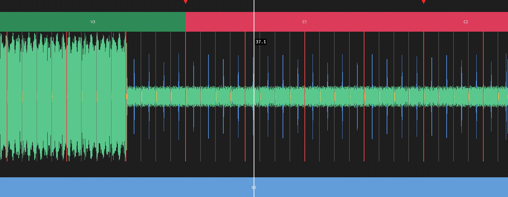

# Mixlyzer in Rust

A reimplementation of Mixlyzer as a Rust workspace: the analysis pipeline, the
library, Rekordbox export, external deck sync, a desktop application and a
command-line front end.

```
mixlyzer-core     domain types and pure logic: beatgrid, key, phrases,
                  cue points, JumpCUEs, configuration
mixlyzer-dsp      decoding and analysis: envelopes, onsets, tempo, key,
                  JumpCUE detection, and the stage order
mixlyzer-phrase   song structure: beat-level features and the two
                  gradient-boosted models over them
mixlyzer-store    SQLite library, feature files, schema migrations
mixlyzer-export   Rekordbox XML
mixlyzer-sync     following an external deck through its process memory
mixlyzer-ui       the track views, drawn with egui
mixlyzer-app      the desktop application
mixlyzer-cli      the `mixlyzer` binary
```

## Building and running

```sh
cd rust
cargo test --workspace       # 746 tests
cargo build --release
./target/release/mixlyzer analyze /path/to/track.flac
```

No external binary is required. Decoding is in-process through Symphonia, so
unlike the Python app there is no FFmpeg to install, find, or ship.

```
mixlyzer analyze <file> [--json]        analyse and print, storing nothing
mixlyzer add <file> [--force]           analyse and record in the library
mixlyzer list [--order-by <column>]     list the library
mixlyzer export <file> [--out <path>]   write a Rekordbox XML
mixlyzer migrate [--dry-run]            bring the library schema up to date
mixlyzer transitions --from <bpm> --to <bpm> [--tolerance <percent>]
```

`--config` points at a `config.json` (the same file the desktop app uses) and
`--library` overrides the library directory. `--phrase-model` names the
detector weights; without it they are looked for beside the binary and in each
parent directory, and a build that does not ship them still analyses tempo and
key rather than refusing the track.

## What it does on a real file

A synthetic 40-second test track at 128 BPM over an A minor bed:

```
tempo      128.00 BPM
key        Am (8A)
beats      85 (22 bars)
```

On a longer track with real sections, the same command also prints the
structure and the cue points derived from it:

```
phrases (7)
      0:00 - 0:10      INTRO
      0:10 - 0:17      VERSE
      0:17 - 0:41      VERSE
      0:41 - 1:06      VERSE
      1:06 - 1:13      CHORUS
      1:13 - 1:32      CHORUS
      1:32 - 1:40      OUTRO

cue points (3)
   0      1:06  CHORUS_IN
   1      1:13  CHORUS_NEXT/CHORUS_PRE_OUT
   2      1:32  CHORUS_OUT/OUTRO
```

The same file through the Python pipeline, timed stage by stage:

| stage | Python | Rust |
|---|---:|---:|
| decode | 1.73s | |
| HPSS | 2.52s | |
| onset detection | 0.19s | |
| tempo and grid | 0.30s | |
| **total** | **4.74s** | **1.68s** |

The Python column stops after the beatgrid; the Rust total also includes the
chromagram, the key decode and the key segments. Both agree on 128.00 BPM.

## Agreement with the Python implementation

`parity/compare.py` builds the same fixtures through both implementations and
diffs every field:

```sh
.venv/bin/python rust/parity/compare.py          # core logic
.venv/bin/python rust/parity/phrase_parity.py    # the librosa features
.venv/bin/python rust/parity/pipeline_parity.py  # the whole detector
```

The 24 key labels and their harmonic neighbours, the database segment rows,
phrase numbering, fill merging, phrase colours, cue points, downbeat indices and
`bar.beat` labels all match exactly. The only differences it reports are two
deliberate ones, listed below.

## Where this deliberately differs

Each of these is a bug in the original, documented at the code that changes it
and pinned by a test whose name states the new behaviour.

**Migration cannot mistake a count for an error.** The Python 0.2.0 → 0.3.0 step
returns the number of files it converted, and the runner treats any non-zero
return as failure — so every existing library with at least one track fails
migration on every launch, never gets its version stamped, and the app exits. A
step here returns `Result<MigrationOutcome, _>`, with the count inside the
success value where it cannot be read as a status.

**One definition of a downbeat.** Python computes bar starts two different ways:
by accumulating seconds (for the beatgrid view) and by counting beat indices
(for the playhead and metronome). On a detected grid with ordinary jitter the
two drift apart by 145 ms on average and 360 ms at worst over an hour. Here
`downbeat_times` is derived from `downbeat_indices`, so a bar line always lands
on a real beat.

**The autocorrelation is indexed correctly.** Python slices the autocorrelation
to the searched lag range and then indexes that slice with unsliced lags minus
the range start, subtracting the offset twice. At the default range the negative
indices wrap and merely rank candidates by unrelated values; narrow the range to
120–140 BPM in the settings and it raises `IndexError` and the track fails.

**Both modes are tracked.** Python scores only the twelve major templates and
then forces one mode across the whole track. All 24 keys are states in the same
decode here, so A minor is reported as A minor rather than as its relative
major, and a modal change is just another transition.

**Startup failures are recoverable.** An unreachable library path, a corrupt
`library.db` and a bad log path each kill the Python app before a window exists,
with no way to reach the setting that caused it. Every one of them is a typed
error here, naming the path.

**Configuration is type-checked.** Python coerces with `bool(value)`, so the
JSON string `"false"` becomes `true`, and a malformed file is overwritten with
defaults — silently discarding the library path along with everything else. A
malformed file is an error here and is left alone. Sections the Rust tools do
not use are round-tripped untouched, so sharing `config.json` with the desktop
app is safe.

**Hot cues do not collide.** Rekordbox has eight hot-cue buttons; Python assigns
the ninth cue onward with `idx % 8`, overwriting cues that already hold those
buttons. Allocation here gives each cue the button its label names, fills the
free ones, and emits the surplus as memory cues.

**Phrase abbreviations stay distinct.** Python abbreviates by first letter, so
INTRO and INTERLUDE both render as "I" and BRIDGE and BREAK_CHORUS both as "B".
An explicit table gives IL and BC.

**Times are `f64`.** Cue points are stored as float32 in Python, whose
resolution two hours in is 0.49 ms — inside the 1 ms deduplication window, so
distinct cues in a long mix silently merge.

**Custom phrase colours are stable.** Python picks them with the randomised
builtin `hash()`, so a user's own label changes colour on every restart.

## Interoperating with an existing library

The SQLite schema is byte-identical to the Python one, including the
self-healing `time_signature` column, so `list`, `transitions` and the track
table work directly against a library the desktop app wrote.

Feature files are not shared. Python stores per-track arrays as NumPy `.npz`;
this workspace uses its own `.mxf` format, which is self-describing, versioned,
CRC-checked and written atomically. A library carrying `.npz` features will
migrate and list correctly, but its stored analysis has to be recomputed with
`mixlyzer add --force` before `export` can use it.

## Not reimplemented

- The editor's undo history and the segment reanalysis workers.
- Audio playback. The application draws the transport and moves the playhead,
  but nothing is sent to a sound device yet.

## The desktop application

`mixlyzer-ui` holds the views and the interaction rules; `mixlyzer-app` is the
window around them. The split is deliberate: the UI crate opens no window and
owns no event loop, so a view can be run for one frame in a test and asked what
it painted.

```sh
cargo run --release -p mixlyzer-app                       # the window
cargo run --release -p mixlyzer-app --example render_track -- track.flac out.png 34
```

The example analyses a file and rasterises one frame to a PNG. It needs no
display, which is how the views are checked on a build machine.



Top to bottom: cue markers, the phrase strip, the waveform with the beat grid
over it, the JumpCUE regions, and the key strip. The playhead carries the
`bar.beat` readout.

Every view is handed one `Viewport`, which owns the single mapping from track
time to screen position. The Python views each recomputed that mapping from the
timeline's fields, so the convention was restated in eight files and they did
not entirely agree; a bar line drawn by one and a `bar.beat` label drawn by
another could disagree by a third of a second.

Two further differences worth naming. The waveform is scaled to the track's own
loudest frame, because the envelopes hold RMS rather than peak and a track
mastered to full scale still measures around 0.2 — drawn unscaled it fills a
fifth of the view. And the strips are laid out in fractions of the view's
height rather than in fixed pixel offsets, so they stay aligned when the window
is resized.

## Finding the song structure

`mixlyzer-phrase` says where the intro ends and where the chorus starts. It is
two gradient-boosted models over beat-level acoustic features: one scores every
beat for how much it looks like a boundary, the other labels the segments
between the chosen boundaries, and a dynamic program picks the labelling that
best fits the transition and length priors. Both run the shipped
`assets/weights/phrase_analyzer.npz` — the same artifact the Python app uses,
read directly, with no Python in the loop.

The models split on raw librosa feature values, so a feature that is *close*
degrades the output into something that still looks like a plausible song
structure rather than failing visibly. Every frame-rate feature is therefore a
port of a specific librosa routine rather than a reimplementation in spirit,
and `parity/phrase_parity.py` checks each one against librosa itself: the worst
disagreement across all seventeen is 9.2e-05, on MFCC, and `estimate_tuning` is
bit-exact. `parity/pipeline_parity.py` then checks everything built on top —
the beat grid, the 1761-column boundary matrix, the per-beat probabilities, the
segment features and the label log-probabilities — and the discrete decisions,
the boundaries and the labels, come out identical.

Two things are deliberately not the same:

**The end-state prior is off by default.** The shipped transition matrix gives
P(END | SILENCE) = 0.863 against P(END | OUTRO) = 0.0026, a 5.8 nat gap. That
is an artifact of the training annotations, which end each track with a
trailing silence segment; the boundary detector never emits one at inference,
so the prior has nothing legitimate to reward and instead relabels the last
phrase of an ordinary fade-out as SILENCE, overriding a label classifier that
is often 80% confident otherwise. `PhraseOptions::matching_python` restores it
for parity checking.

**Resampling happens in the pipeline, not the detector.** The models were
trained at 22.05 kHz and `detect_phrases` refuses anything else rather than
resample it itself, for the same reason as above. `mixlyzer-dsp` does the
conversion with the band-limited kernel the decoder already uses, so a library
configured for 44.1 kHz analysis still gets phrases.

Phrase detection needs the weights, which are a file rather than a setting, so
it is the one stage the config cannot switch on by itself:

```rust
let options = AnalysisOptions::discovering_phrase_model();
let analysis = pipeline::analyze_file_with(path, &config, &options)?;
```

`analyze_file` without options runs every other stage and reports no phrases.
An empty phrase list therefore always means "no model" — a detector that ran
and failed is `AnalysisError::Phrase`, never silence. Cue points are derived
from whatever phrases came back, so they follow the same rule.

## Following an external deck

`mixlyzer-sync` reads another DJ program's memory to follow what it is playing.
The parsing, the process denylist, the deck state machine and the failure policy
are portable and tested on any platform against an in-memory fake; the actual
process access is a Windows backend behind a `cfg`, checked by cross-compiling.

The behaviour that changes: Python disables the whole feature on the *first*
read failure and writes `enabled=false` back to `config.json`, so a null pointer
during a track load turns it off until the user notices and re-enables it by
hand. Here transient failures are tolerated with a backoff, and only something
genuinely permanent — the process is gone, or it is on the denylist — disables
anything. Nothing rewrites the config file.

Two Python bugs are fixed and pinned: the pointer read width was chosen from
whether the *address* exceeded 2³¹ rather than from the target's bitness, which
mis-dereferences on 64-bit targets; and UTF-16 string reads could not work at
all, because the read stopped at the first NUL byte, which is the second byte of
every ASCII-range UTF-16 character.

## Finding JumpCUEs

`mixlyzer_dsp::jumpcue_detect` finds passages that sound alike, so a DJ can jump
between them: a beat-synchronous mel matrix, a cosine self-similarity matrix,
peaks in the similarity-versus-lag profile, then the contiguous run at each lag.

The bug worth naming is an indexing one. The matrix is decimated once a track
passes roughly four thousand beats, to bound an O(T²) similarity matrix, but
Python then indexes the decimated matrix with full-resolution beat numbers and
converts columns back to time as though no decimation had happened — so on a
long mix every cue lands somewhere it should not. Here one type owns the
column-to-beat mapping and nothing outside it infers a beat number from a
column.
